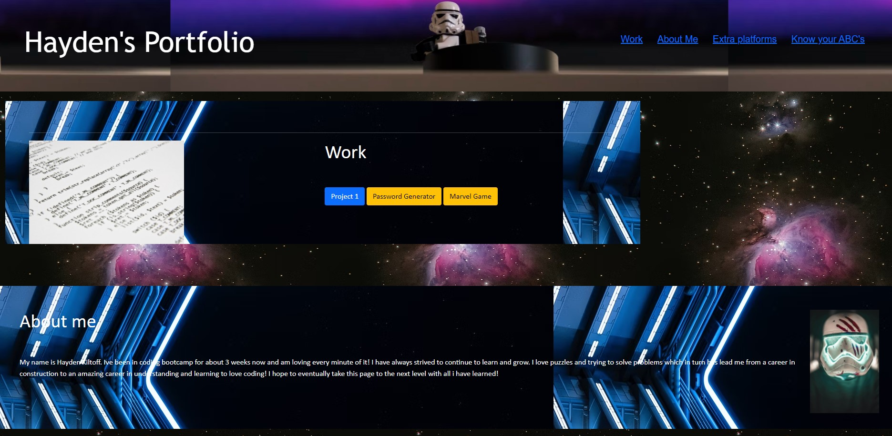
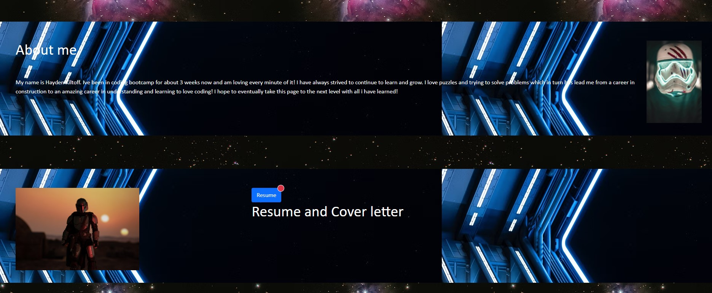

# hk-port

**Description**:
Portfolio for Hayden Kiltoff
starwars themed

**Define**
GIVEN I need to sample a potential employee's previous work
WHEN I load their portfolio
THEN I am presented with the developer's name, a recent photo or avatar, and links to sections about them, their work, and how to contact them
WHEN I click one of the links in the navigation
THEN the UI scrolls to the corresponding section
WHEN I click on the link to the section about their work
THEN the UI scrolls to a section with titled images of the developer's applications
WHEN I am presented with the developer's first application
THEN that application's image should be larger in size than the others
WHEN I click on the images of the applications
THEN I am taken to that deployed application

**mock up**





> **Note**: This layout is designed for desktop viewing, so you may notice that some of the elements don't look like the mock-up at a resolution smaller than 768px. Eventually you'll learn how to make elements responsive so that your web application is optimized for any screen size.

## Changes made:

1.Body
    - portfolio with linked drop down per name and allocation
    -linked images for work, about extras, and profile contact
    -description of about me
    -generic tagged videos for refrence of future work
    -side profile for simple contact and elements of link


   ```
2. `(CSS)` 
   ```
  - CSS is lightly cleande up per section
  - Each with specific class and boxed per header
  - half are individually assigned while others are grouped together

   ```

## Review


* The URL of the deployed application.
https://hayden1773.github.io/hk-port/

* The URL of the GitHub repository, with a unique name and a README that describes the project.
https://github.com/hayden1773/hk-port